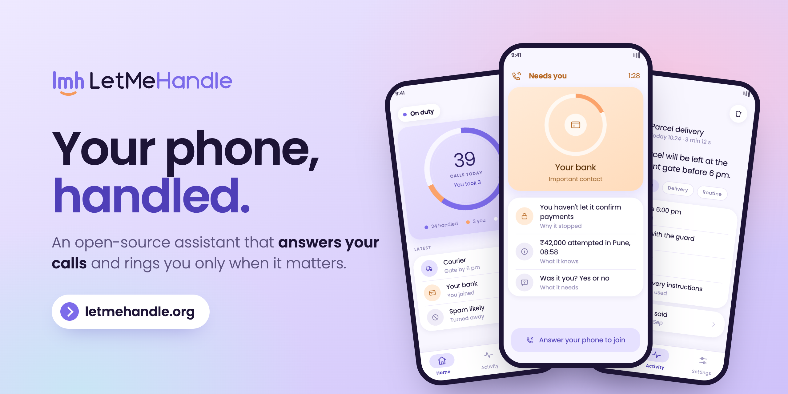
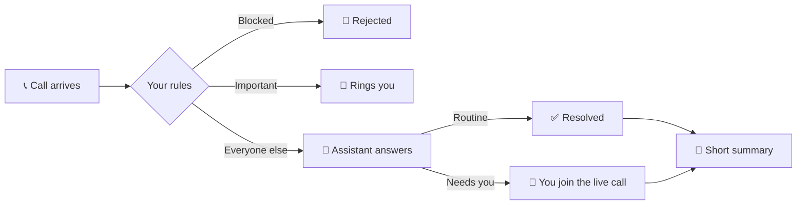

<p align="center">
  <a href="https://www.letmehandle.org">
    
  </a>
</p>

<p align="center">
  <a href="https://www.letmehandle.org"><b>🌐 letmehandle.org</b></a>
  &nbsp;·&nbsp;
  <a href="PLAN.md">Plan</a>
  &nbsp;·&nbsp;
  <a href="docs/architecture/overview.md">Architecture</a>
  &nbsp;·&nbsp;
  <a href="CONTRIBUTING.md">Contribute</a>
</p>

<p align="center">
  <a href="https://github.com/letmehandle-org/letmehandle/actions/workflows/ci.yml"></a>
  <a href="LICENSE"></a>
  <a href="https://www.letmehandle.org"></a>
</p>

# LetMeHandle

An AI assistant that **answers your phone calls**, works out what the caller wants, and follows
your preferences. It resolves the routine calls on its own and **brings you into the same live
call** when it really needs you.

> [!NOTE]
> **Early construction.** The repository has been public from its first commit, so the
> architecture can be reviewed from the start. It does not answer calls yet.
> [`PLAN.md`](PLAN.md) says exactly what is built, what is being built, and what is not.

## How it works



1. **A call arrives.** Fixed rules you set decide whether it rings you, is rejected, or is
   handled.
2. **The assistant talks to the caller** in real time and works out why they are calling.
3. **Routine calls get resolved.** When a person is needed, your phone rings, a notification
   says why before you answer, and answering joins you to the call already in progress. The
   caller never has to call back.
4. **You get a short summary** afterwards, not a transcript dump.

## What it is not

| | |
| --- | --- |
| ❌ A voicemail transcriber | It holds the conversation. |
| ❌ An app-to-app calling product | It is built around real phone calls. |
| ❌ Finished | See the note above. |

## Privacy at a glance

| | |
| --- | --- |
| 🎙️ **No recordings** | Calls are not recorded. |
| 🔐 **Encrypted transcripts** | Encrypted at rest and deleted on a schedule each user controls, 7 days by default. |
| 📝 **Summaries stay** | The structured summary is kept after the transcript is deleted. |
| 📇 **Contacts stay on your phone** | Only the contacts you mark as important reach the server. |

The full policy is at [letmehandle.org/privacy](https://www.letmehandle.org/privacy). What the
project does and does not protect against is written down in
[`docs/architecture/security.md`](docs/architecture/security.md). Before deploying it anywhere
reachable, read
[`docs/development/self-hosting-security.md`](docs/development/self-hosting-security.md).

## Replaceable by design

Every outside service sits behind a port with adapters, and the domain layer imports none of
them. The build enforces this, not just convention.

| Port | What you can swap |
| --- | --- |
| `SpeechProvider` | the realtime speech model |
| `CallAgent` | the model that makes decisions: any OpenAI-compatible endpoint, hosted or local |
| `CallTransport` | how calls reach the system: programmable telephony, the platform's own call screening, or a future SIP or carrier integration |
| `VoiceProvider` | how the assistant sounds |
| `NotificationProvider` | how you are alerted |
| `OTPProvider` | how sign-in codes are delivered |

Providers declare what they can do. The product adapts to that and never offers a feature
your provider does not support.

<details>
<summary><b>Why transports matter most</b></summary>

<br>

Call transports differ in kind, not only in vendor. Android can screen a call before the
handset rings, but it cannot give an app the audio of a SIM call. Programmable telephony can
stream that audio and bridge a second person into a call already in progress. Both use the
same interface, and the product asks what a transport can do rather than which one it is.

</details>

To write your own, see [`docs/providers/`](docs/providers/).

## Getting started

**You need:** Python 3.12, Node 22, pnpm 9 and Docker. For the mobile app you also need Xcode
or Android Studio.

```bash
git clone https://github.com/letmehandle-org/letmehandle.git
cd letmehandle
make setup
cp .env.example .env
make up
curl localhost:8000/health
```

Full instructions, including the mobile toolchain, are in
[`docs/development/setup.md`](docs/development/setup.md).

## Documentation

| Document | What it covers |
| --- | --- |
| [`PLAN.md`](PLAN.md) | how this is being built, phase by phase |
| [`docs/architecture/overview.md`](docs/architecture/overview.md) | the shape of the system |
| [`docs/architecture/decisions.md`](docs/architecture/decisions.md) | why it is shaped that way |
| [`docs/providers/`](docs/providers/) | writing a provider |
| [`docs/architecture/security.md`](docs/architecture/security.md) | the threat model, and what is not defended |
| [`docs/development/self-hosting-security.md`](docs/development/self-hosting-security.md) | running a deployment securely |
| [`SECURITY.md`](SECURITY.md) | reporting a vulnerability |
| [`CONTRIBUTING.md`](CONTRIBUTING.md) | how to contribute |

## Licence

MIT. See [`LICENSE`](LICENSE).

<p align="center">
  <a href="https://www.letmehandle.org"></a>
  <br>
  <sub><a href="https://www.letmehandle.org">letmehandle.org</a></sub>
</p>
