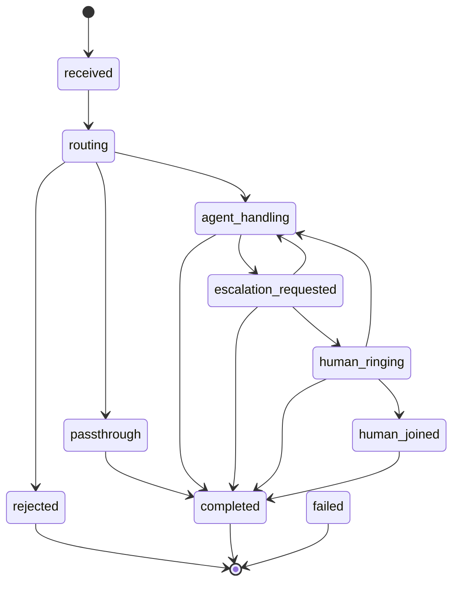
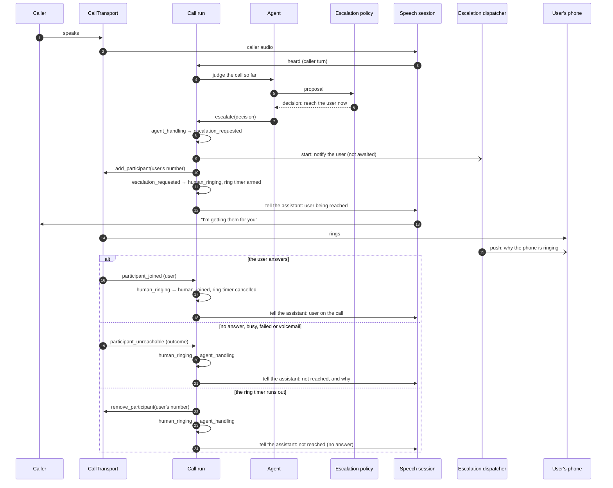

# Call flow

The life of one call: the states it can be in, how it moves between them, and what happens when the
assistant needs the user. Written from
[`domain/models/call_state.py`](../../apps/backend/src/letmehandle/domain/models/call_state.py) and
[`application/orchestration/`](../../apps/backend/src/letmehandle/application/orchestration/). The
decisions behind it are D-016, D-029 and D-033.

## Who moves a call

One `CallOrchestrator` reads the transport's events. Each new call gets a *run*: an inbox of inputs —
transport events, what the speech session heard, the agent's judgements and requests, timer
expiries — handled one at a time by that run alone. Nothing else writes a call's state, and a test
(`test_call_state_has_one_writer.py`) fails if something tries. Two inputs for one call cannot
interleave; two calls never wait on each other.

## The state machine

Every allowed move, from the one transition table in `call_state.py`. Any state that is not an ending
may also move to `failed`, which the table adds to each of them rather than listing it seven times;
the diagram leaves those arrows out for the same reason. A test,
`apps/backend/tests/unit/test_call_flow_document.py`, fails when this diagram and the table disagree.

| State | Means |
| --- | --- |
| `received` | The transport announced the call and its owner was found. |
| `routing` | The user's rules are being applied. |
| `passthrough` | The call goes to the user without the assistant: it rings where it is, or the user's phone is dialled into it. |
| `agent_handling` | The assistant is on the call, talking to the caller. |
| `escalation_requested` | The escalation policy decided the user is needed now; the notification is on its way and the user's phone is being dialled. |
| `human_ringing` | The user's phone is ringing, and the assistant keeps the caller company. |
| `human_joined` | The user is on the call. |
| `rejected` | Ended: the rules refused the call. |
| `completed` | Ended: the call ran its course. |
| `failed` | Ended: something the call needed broke. |

The three endings stay distinct because they mean different things in the call history and in the
metrics.

## Arrival and routing

1. **Whose call.** The transport's `CallOwnership` names the user (D-033). A call nobody owns — or one
   arriving while storage cannot say — is let go at the transport and recorded nowhere.
2. **The plan.** Before anything happens, `plan_for` derives from the transport's capabilities which
   steps this call can take: putting it through, the assistant, escalation. A step the transport
   cannot perform is never built. See [the capability matrix](call-transport.md#capability-matrix).
3. **Routing.** `domain.policy.routing.route` turns the caller and the user's preferences into a
   posture — withheld number, important contact, blocked category, the category's posture, then the
   user's hours. `route_on` turns the posture into what this plan can do, falling back in a fixed
   order when it cannot. A call a handset already screened goes where the handset sent it.
4. **The first move.** `routing` → `agent_handling` (the assistant answers and the speech session
   opens), `passthrough`, or `rejected`. An answer or a speech session that fails moves the call to
   `failed`.

## While the assistant has the call

Everything the caller says is written to the transcript. While the user is not on the call, each new
caller turn asks the agent for a judgement, one at a time; a turn arriving during a judgement is
looked at once that judgement finishes. A judgement that fails or runs out of time changes nothing:
the assistant carries on.

The agent affects the call only through `CallActions`, which the run implements:

| Request | What the run does |
| --- | --- |
| `escalate` | the escalation sequence below |
| `record_outcome` | keeps the outcome for the summary |
| `take_message` | keeps the message for the summary |
| `end_call` | `resolved` or `declined`: `completed`. `handed_over`: see below |

The model proposes; it never decides whether the user's phone rings. `domain.policy.escalation`
decides that from the proposal and the user's own threshold: never for a suspected scam from a
stranger, only with a reason, and only above the threshold unless the caller is an important contact.

## The escalation sequence

What the sequence guarantees:

- **The ring is the escalation** (D-016). The notification is started and never awaited; a push that
  is slow, fails or is never configured delays nothing. It is sent once per call however often the
  agent asks, and the app can fetch the context itself when no push arrives.
- **Not now is not never.** A decision that is not immediate rings nothing; its reason is kept, and
  the user reads it in the call's history.
- **One ring at a time.** An escalation while the user is already being reached, or is on the call,
  changes nothing.
- **An unreachable user is not a dropped call.** The call returns to the assistant, which is told the
  outcome and carries on with the caller. A call ending because its owner was busy is the failure the
  product exists to prevent.
- **A dial the transport refuses** returns the call to `agent_handling` at once, and the agent is told
  the request failed.
- **Handed over, not hung up.** When the agent ends its part by handing over while the user is still
  being reached, the assistant stays with the caller until the user answers, and takes the call back
  if they do not. Handed over to a user who is already there, the assistant stops speaking and the
  call stands between the caller and the user.
- **Once the user has joined**, the agent is not asked to judge again: the call is theirs.

## Endings

Every ending reaches one teardown, which runs once:

1. The final state is decided.
2. The judgement, the timers and the speech session stop, and each is awaited.
3. The transport lets the call go.
4. The agent's memory of the call is released.
5. The summary is written: by the model for a call the assistant handled, when a model is configured
   and answers within its bound, with the agent's recorded outcome laid over it; otherwise from the
   call's facts.
6. The final state and the summary are stored together, as the last write.
7. The user's escalation context, if there was one, is marked ended.

What ends a call:

| Input | From | To |
| --- | --- | --- |
| The caller hangs up (`ended`) | any live state | `completed` |
| The transport reports a failure (`failed`) | any live state | `failed` |
| The user leaves | `human_joined`, `passthrough` | `completed` |
| The assistant's leg is unreachable, or its conversation fails | `agent_handling` | `failed` |
| The assistant's leg leaves, or its audio stops, with no hang-up reported within `speaker_gone` | `agent_handling` | `failed` |
| The agent ends the call, other than by handing over | `agent_handling`, `escalation_requested`, `human_ringing`, `human_joined` | `completed` |
| Nobody picks up a call put through | `passthrough` | `completed` |
| The process stops | any live state | `failed` |

## Bounds

Every wait has a bound, and every expiry is a transition rather than an exception. From `Bounds` in
`application/orchestration/ports.py`:

| Bound | Default | When it runs out |
| --- | --- | --- |
| `ring` | 30 s | the user is treated as not reached |
| `judgement` | 20 s | the judgement is dropped; the call carries on |
| `speech_open` | 10 s | the call fails |
| `provider` | 10 s | the request to the transport is treated as refused |
| `storage` | 5 s | a write is logged and counted; finding an owner treats the call as nobody's |
| `speaker_gone` | 5 s | a conversation whose audio stopped, or an assistant's leg that left, with no ending reported, is treated as lost |
| `summary` | 10 s | the call is summarised from its facts |
| `shutdown` | 15 s | stopping gives up waiting for calls to tear down |

## After a restart

A live call cannot be resumed: its audio stream and speech session went with the process. At
startup, every call found unfinished is ended at its transport where possible, moved to `failed` and
summarised from its facts (`application/orchestration/recovery.py`).
