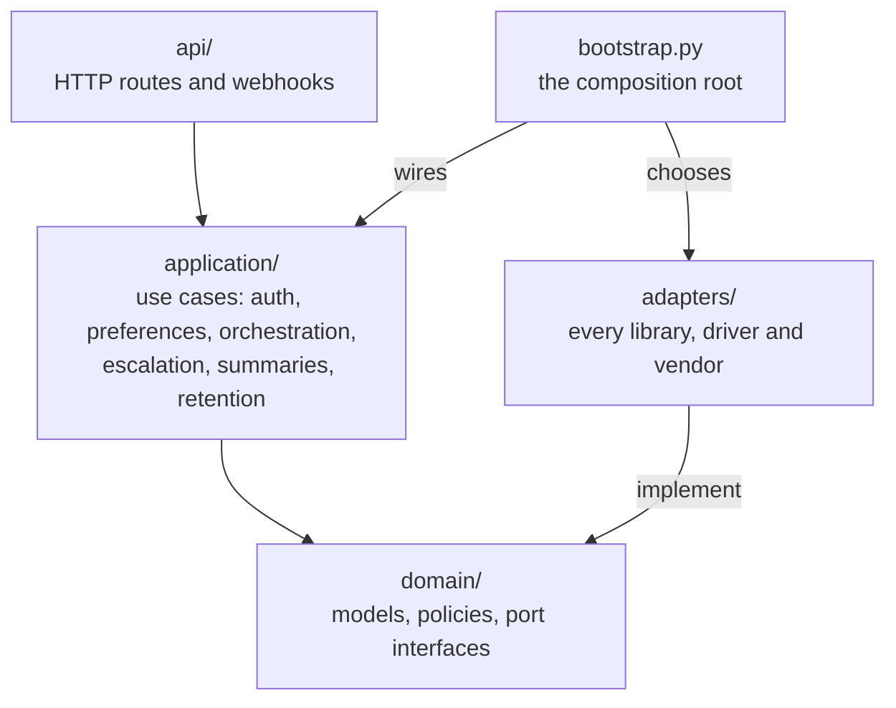
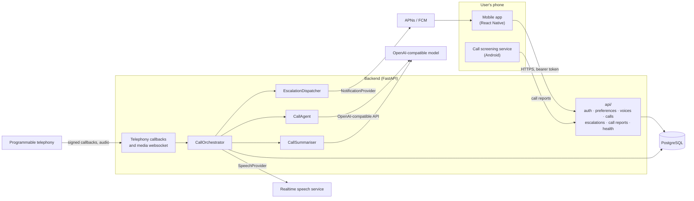
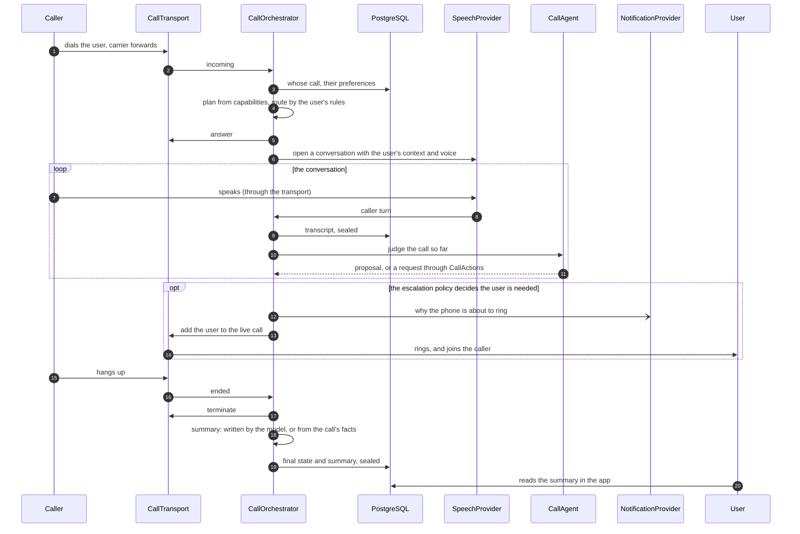

# Architecture overview

## The shape

Three layers, and the dependency arrow only points one way.

`domain/` imports nothing from `adapters/`, `api/`, or any third-party SDK. `application/` names no
agent framework, model client or adapter. Adapters depend on the domain's interfaces; the domain
never learns what implements them. `bootstrap.py` is the one module that decides which adapter each
port gets.

This is checked by import-linter in `make verify`, so it is a property of the build rather than a
habit. Adding a vendor import to a domain module fails the build.

## Components

Every external service on the right is reached through a port and is optional to start the backend:
without any of them it signs people in, stores preferences and serves call history, and carries no
calls. See the [configuration reference](../development/configuration.md) for what turns each on.

## Ports

A port is an interface the product needs from the outside world. Each declares capabilities, so
callers ask what a provider can do rather than assuming.

| Port | Responsibility | Implemented by |
| --- | --- | --- |
| `CallTransport` | how a call exists: observe, screen, answer, stream, inject, add a participant, terminate | `adapters/transport/twilio`, `adapters/transport/android_native` |
| `SpeechProvider` | realtime spoken conversation: audio in, audio out, interruption, context | `adapters/speech/realtime`, `adapters/speech/elevenlabs` |
| `CallAgent` | judgement: intent, importance, structured decisions, through tools (an application port, D-026) | `adapters/agent/strands` |
| `VoiceProvider` | how the assistant sounds: catalogue, preview, custom voices | `adapters/voice/builtin.py` |
| `NotificationProvider` | reaching the user's device | `adapters/notification/apns`, `adapters/notification/fcm` |
| `OTPProvider` | delivering a sign-in code | `adapters/otp/mock.py` only |
| `Clock`, `IdGenerator` | time and identity, injected so tests control both | `adapters/clock.py` |

Every port has a contract test suite. An implementation proves itself by passing that suite, which
means a simulator used in tests and a real adapter used in production are held to the same standard —
and divergence between them shows up as a contract failure rather than as a production surprise.
Each has a page in [`docs/providers/`](../providers/).

## A call, from ring to summary

On the streaming transport, where the assistant can take the call. The state machine and every
alternative path are in [`call-flow.md`](call-flow.md).

The orchestrator is the only writer of call state. The agent proposes; a deterministic policy
decides; the orchestrator acts.

## Why it is split this way

The assistant that talks and the assistant that decides are different concerns with different
failure modes. Keeping them apart means the authority decision is auditable without replaying
audio, and either half can be replaced without touching the other.

The transport a call arrives on is not part of the product. Two are implemented — the platform's
own call screening on Android, and programmable telephony that a user's carrier forwards calls to —
and a SIP trunk or a carrier integration would be the same port with another adapter. They differ in
what they can do, not merely in who provides them, which is why the core asks about capabilities
rather than names. The matrix, what each combination supports, and the extension path are in
[`call-transport.md`](call-transport.md).

## Decisions

Numbered, with reasoning, in [`decisions.md`](decisions.md). Phase plans cite them by id so a
decision lives in one place and its change is visible in history.
